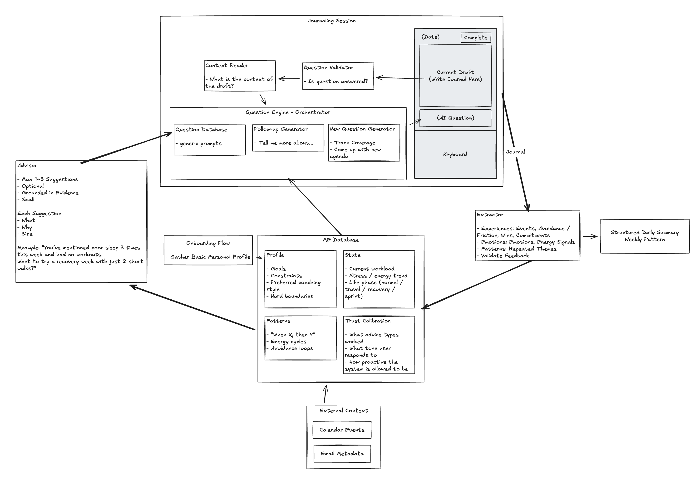

# Reflect

> This repo builds an iOS AI journaling app. Users can record a journal in **text or voice**, receive optional AI nudges during a session, and get a structured daily summary plus small suggestions at completion. All journaling data is stored in Supabase Postgres as the source of truth.
Source: `docs/architecture.md`

## Holistic structure



## Product intent (doc excerpts)

> Voice input uses **on-device speech-to-text** for MVP, with a provider abstraction so we can swap to a cloud transcription API later without refactoring the product core.
Source: `docs/architecture.md`

## Project structure

- `reflect/`: SwiftUI app source and assets.
- `reflect.xcodeproj/`: Xcode project and shared scheme.
- `reflectTests/`: Unit tests.
- `reflectUITests/`: UI tests.
- `supabase/`: Supabase config, Edge Functions, migrations, seed data.
- `docs/`: Architecture notes and realtime questions guide.

## App modules (by file)

- Views: `ContentView.swift`, `LoginView.swift`, `OnboardingView.swift`, `RecordingView.swift`, `RecordingModeView.swift`, `ProfileEditorView.swift`, `RootView.swift`.
- State/logic: `RecordingViewModel.swift`, `AuthStore.swift`, `QuestionEngine.swift`, `QuestionService.swift`, `QuestionPool.swift`.
- Data/models: `JournalModels.swift`, `QuestionModels.swift`, `JournalRepository.swift`, `ProfileRepository.swift`.
- Platform/utilities: `TranscriptionProvider.swift`, `OpenAITranscriptionProvider.swift`, `SupabaseClientProvider.swift`, `Notifications.swift`, `GradientTheme.swift`, `Color+Hex.swift`.

## Supabase functions

- `supabase/functions/questions/`
- `supabase/functions/transcribe/`

## Build and test

```sh
xcodebuild -scheme reflect -destination 'platform=iOS Simulator,name=iPhone 17 Pro' build
```

```sh
xcodebuild -scheme reflect -destination 'platform=iOS Simulator,name=iPhone 17 Pro' test
```

## Docs

- `docs/architecture.md`
- `docs/RealtimeQuestions.md`
