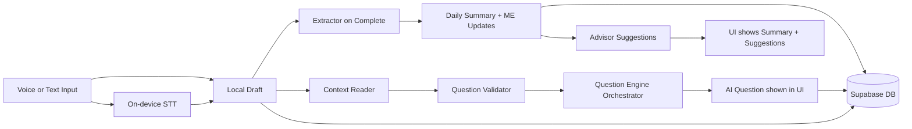
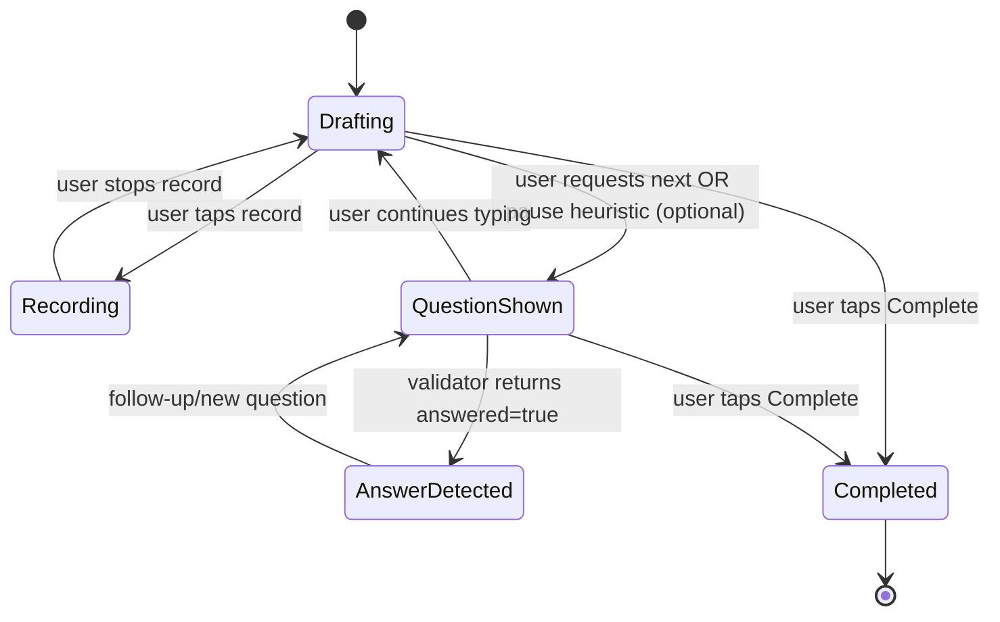

# Architecture

## Purpose

This repo builds an iOS AI journaling app. Users can record a journal in **text or voice**, receive optional AI nudges during a session, and get a structured daily summary plus small suggestions at completion. All journaling data is stored in Supabase Postgres as the source of truth.

Voice input uses **on-device speech-to-text** for MVP, with a provider abstraction so we can swap to a cloud transcription API later without refactoring the product core.

## Goals

- Fast journaling experience that feels lightweight on mobile.
- “Nudges” that are:
  - optional (non-blocking),
  - concise,
  - grounded in the user’s own text,
  - not overly proactive unless the user opts in.
- Session completion produces:
  - structured daily summary,
  - detected signals (energy/stress/avoidance patterns),
  - ME Database updates (profile/state/patterns/trust calibration),
  - optional 0–3 tiny suggestions.
- Cloud-first: all journaling data is stored in Supabase Postgres.

## Non-goals for MVP

- Real-time audio streaming and low-latency streaming transcription.
- Calendar/email integrations (we’ll stub the interfaces).
- Full multi-device sync conflict resolution (we’ll design the data model to support it later).

## High-level system overview

### Components

1) **iOS app (SwiftUI)**
- UI flows: onboarding, journaling session, recording, history, settings.
- Local draft cache is allowed for UX, but not the primary store.
- Local transcription provider interface (on-device by default).

2) **Backend AI Gateway (Supabase Edge Functions)**
- Single responsibility: handle LLM calls and pipeline orchestration.
- Keeps API keys and model routing out of the mobile client.
- Produces strict JSON outputs that are schema-validated.
- LLM provider abstraction (OpenAI first, swap later).

3) **Persistence (Supabase Postgres)**
- Source of truth for sessions, entries, summaries, and ME DB.
- Row Level Security for per-user access control.

4) **Runtime AI modules (conceptual)**
- Context Reader
- Question Validator
- Question Engine Orchestrator
  - Question Database
  - Follow-up Generator
  - New Question Generator
- Extractor
- Advisor
- ME Database
  - Profile
  - State
  - Patterns
  - Trust Calibration
- External Context (future)
  - Calendar Events
  - Email metadata

### Data flow



## Key concepts

- **Session**: a journaling interaction with start/end time.
- **Draft**: current editable text in the session.
- **AI Question (Nudge)**: a single question shown to the user; never blocks typing.
- **Transcript**: speech-to-text output that becomes the draft text.
- **Chunk**: a snapshot of text at certain times (optional); useful for later “evidence” and debugging.
- **Daily Summary**: structured extraction from the final draft.
- **ME Database**: user personalization state (profile/state/patterns/trust calibration).

## iOS app architecture

### Screens
- `/onboarding`
  - capture basic profile & boundaries (tone, proactivity, topics to avoid).
- `/journal`
  - date header, draft editor, nudge dock, “Next question”, “Complete”.
- `/recording`
  - record, pause, stop, live transcript preview, fallback to text edit.
- `/history`
  - list sessions + open summary.
- `/settings`
  - trust/proactivity controls, export/delete, debug toggles.

### State management (recommended)
- **Session state** (local store): current sessionId, draft text, recording state, last question, question history, whether last question is answered.
- **Data state**: history list, session details, summaries, ME DB read/write.
- **Persistence**: Supabase client with typed queries and a small local cache for drafts.

### Session state machine



Notes:
- MVP can trigger questions only via a button (“Next question”).
- Later you can add a pause-based heuristic (e.g., 2–4 seconds idle) if desired.

### Transcription provider abstraction

Define a thin interface for speech-to-text so providers can be swapped:

- `TranscriptionProvider.start()`
- `TranscriptionProvider.stop()`
- `TranscriptionProvider.onPartial(text)`
- `TranscriptionProvider.onFinal(text)`

Default implementation uses on-device speech recognition. A cloud provider can be dropped in later without changing the session flow.

## Database schema (Supabase Postgres)

Keep schema simple and evolve later. Suggested tables:

### `journal_sessions`
- id (uuid)
- user_id (uuid)
- started_at (timestamp)
- ended_at (timestamp, nullable)
- status (draft | completed)
- mode (text | voice)
- title (nullable; derived later)

### `journal_entries`
- id (uuid)
- session_id (uuid)
- created_at (timestamp)
- text (string)
- source (user | ai)

### `session_questions`
- id (uuid)
- session_id (uuid)
- created_at (timestamp)
- question (string)
- coverage_tag (string)
- status (shown | answered | ignored)
- answered_text (nullable)

### `daily_summaries`
- session_id (uuid)
- created_at (timestamp)
- summary_json (jsonb)

### `me_db`
- user_id (uuid)
- profile_json (jsonb)
- state_json (jsonb)
- patterns_json (jsonb)
- trust_json (jsonb)
- updated_at (timestamp)

### `transcript_chunks` (optional, for voice audits)
- id (uuid)
- session_id (uuid)
- created_at (timestamp)
- text (string)
- confidence (numeric, nullable)
- provider (string)

## Backend architecture (Supabase Edge Functions + OpenAI)

### Why a backend even for MVP
- Avoid shipping model keys to client.
- Centralize prompt templates, schemas, and safety logic.
- Enable consistent behavior across clients and future platforms.

### Provider abstraction
- `LLMProvider` interface (OpenAI first, swap later)
- `TranscriptionProvider` interface (on-device first, swap later)

### Endpoint contract

Start with a single Edge Function:

`POST /ai/runPipeline`

Request:
```json
{
  "draftText": "string",
  "meContext": {
    "profile": {},
    "state": {},
    "patterns": {},
    "trust": {}
  },
  "lastQuestion": "string|null",
  "sessionHistory": ["string"]
}
```

Response:
```json
{
  "nextQuestion": "string",
  "extracted": {
    "dailySummary": { "headline": "string", "bullets": ["string"] },
    "detectedSignals": [],
    "patternUpdates": { "recurring": [], "emerging": [] },
    "trustUpdates": { "proactivity": "low|medium|high", "sensitivity": "low|medium|high" }
  },
  "advice": {
    "suggestions": [{ "suggestion": "string", "evidence": ["string"] }]
  }
}
```

### Validation and fallbacks
- All backend responses must be schema-validated.
- If the model returns invalid JSON or violates schema:
  - fallback to safe defaults (e.g., pick from Question Database),
  - log a sanitized error (no raw user text),
  - return safe defaults (empty signals/patterns/trust updates, 0–3 suggestions).

### Observability
- Client: crash reporting + analytics events.
- Backend: structured logs (request id, latency, fallback flags) without raw text.

## Security & privacy

- Supabase Auth with Sign in with Apple as primary.
- Row Level Security enforced for all per-user tables.
- Store only required transcript data; allow user delete/export flows.

## Future extensions

- Replace on-device STT with cloud transcription.
- External Context: add ingestion interfaces and user-granted scopes.
- Weekly patterns: scheduled job to aggregate daily summaries -> weekly pattern artifact.

## References

- Supabase capabilities:
  - “Supabase provides all the backend features developers need to build a product: a Postgres database, authentication, instant APIs, edge functions, real-time subscriptions, and storage.”
  - Source: https://supabase.com/docs/guides/platform/migrating-to-supabase/postgres
- OpenAI Responses API:
  - “Creates a new AI model response based on the provided input and model.”
  - Source: https://platform.openai.com/docs/api-reference/responses/cancel
